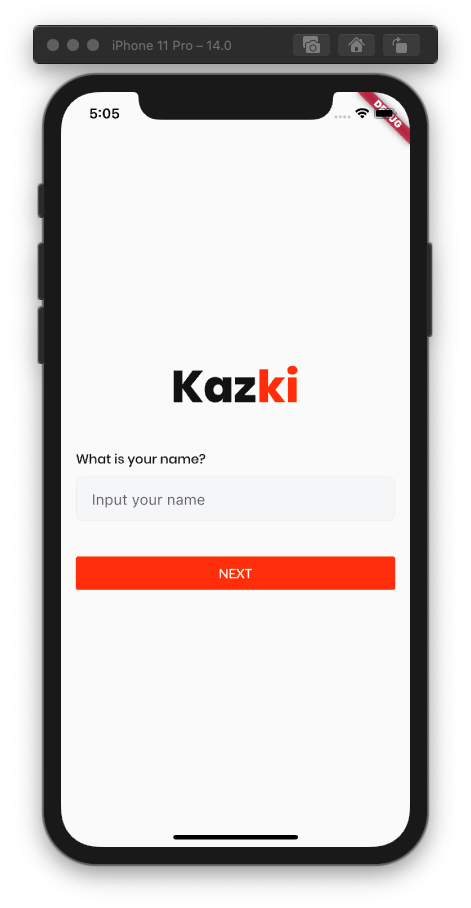

**Choose language:** 
[English](./README.md) | [Bahasa Indonesia](./README_bahasa.md)

# Kazki - Job Seeker Application
> A Flutter application built to fulfill assignment submission in the "Learn to Make Flutter Application for Beginners" class from Dicoding. The work on this project is only an implementation of a design made by Hachibur Rahman, which can be accessed at [this link](https://dribbble.com/shots/14099860-Kazki-Job-Finding-App/attachments/5721545?mode=media).

## Technologies Used
* Dart
* Flutter

## What I Learned
* Use of widgets to build an attractive user interface.
* Use of state to organize the functionality of this application.

## Screen Captures
#### Login Page:

#### Landing Page:

#### Details Page:
