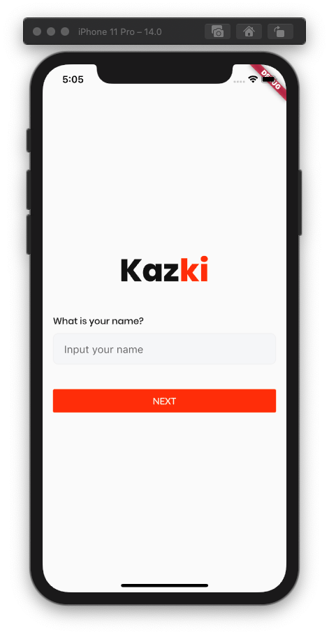
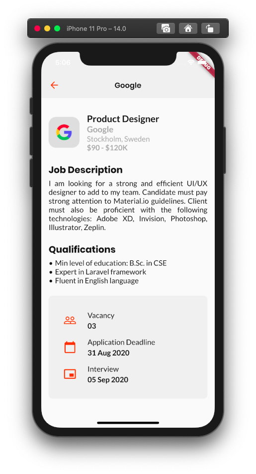

**Pilih bahasa:** 
[English](./README.md) | [Bahasa Indonesia](./README_bahasa.md)

# Kazki - Aplikasi Pencari Lowongan Kerja
> Sebuah aplikasi mobile yang dibangun dengan framework Flutter untuk memenuhi tugas pada kelas "Belajar Membuat Aplikasi Flutter untuk Pemula" dari Dicoding. Pengerjaan proyek ini hanya sebagai implementasi dari desain yang dibuat oleh Hachibur Rahman yang dapat diakses pada [link ini](https://dribbble.com/shots/14099860-Kazki-Job-Finding-App/attachments/5721545?mode=media).

## Teknologi yang Digunakan
* Dart
* Flutter

## Yang Saya Pelajari
* Penggunaan widget untuk membangun tampilan aplikasi yang menarik.
* Penggunaan state untuk menyusun fungsionalitas dari aplikasi ini.

## Tangkapan Layar
#### Halaman Login:

#### Halaman Utama:

#### Halaman Details:
